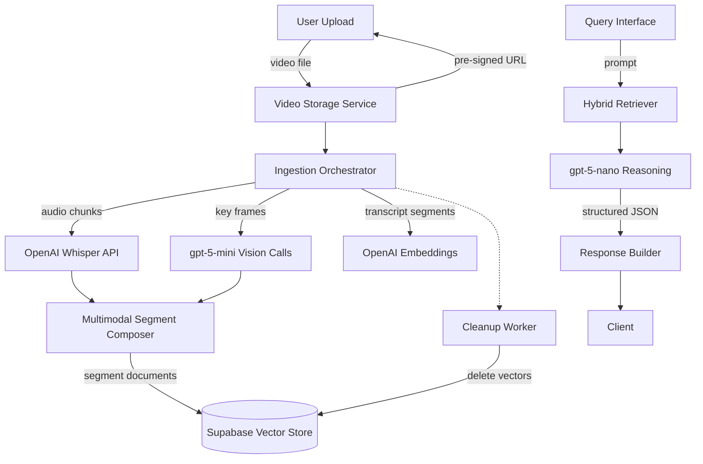

# VideoRAG Cloud-Native Refactor Plan

## Objectives
- Accept a user-uploaded video, process it end-to-end in the cloud, and expose a prompt-based query interface.
- Guarantee that **only cloud-managed OpenAI models** are used for speech, image, text, and embedding workloads.
- Produce **structured JSON responses** for downstream consumers.
- Persist intermediate vector data in **Supabase** during a processing session and purge it afterwards.
- Remove historical dependencies on local or open-source models (ImageBind, MiniCPM, CLIP, etc.) and any GPU-bound runtime assumptions.

## Target Architecture Overview



### Core Components

| Component | Responsibilities | Notes |
|-----------|------------------|-------|
| **Ingestion Orchestrator** | Receives the video metadata, triggers audio extraction, segment definition, key-frame sampling, and coordinates downstream jobs. | Implemented as async task queue worker (e.g., Celery, Temporal, or Supabase Edge function) to decouple uploads from heavy processing. |
| **Audio Processing** | Splits audio into 30–60s windows, calls Whisper via `openai.audio.transcriptions.create`, and returns timestamp-aligned transcripts. | Replace `speech_to_text` implementation to wrap the OpenAI Whisper cloud API rather than invoking `whisper` locally. |
| **Frame Sampling & Vision Calls** | Sample key frames (e.g., 1 fps or scene-change driven) and send batches to `gpt-5-mini` via image understanding endpoint for descriptions, tags, and entities. | Remove any usage of `segment_caption` with MiniCPM; replace with lightweight cloud call that stores captions per frame/segment. |
| **Multimodal Segment Composer** | Merge transcripts, frame-level captions, and timing metadata into canonical segment documents. | Output schema: `{segment_id, video_id, start, end, transcript, captions, keyframes}`. |
| **Embedding & Storage** | Chunk transcript text with configurable window (e.g., 512 tokens) and embed using `text-embedding-3-small`. Store vectors and metadata in Supabase Postgres (pgvector). | Implement `SupabaseVectorStore` with CRUD operations and TTL cleanup. |
| **Retriever** | Hybrid strategy: semantic search via embeddings + optional metadata filters (time range, speakers). | The retriever fetches from Supabase, returns top-k segments with metadata. |
| **Query Orchestrator** | Accepts user prompt, executes retrieval, optionally runs focused follow-up calls (e.g., call `gpt-5-mini` for image-specific clarifications), and composes context. | Use `gpt-5-nano` chat completion with system prompt enforcing JSON schema. |
| **Response Builder** | Validates structured output schema (pydantic/JSON schema) and returns to caller. | Surface citations (segment IDs + timestamps). |
| **Cleanup Worker** | Triggered after session expiry or explicit request to purge vectors and cached assets from Supabase/storage. | Enforce data minimization. |

## API & Data Contracts

### Segment Document Schema
```json
{
  "segment_id": "string",
  "video_id": "string",
  "start": 0.0,
  "end": 0.0,
  "transcript": "...",
  "captions": [
    {
      "frame_ts": 0.0,
      "description": "...",
      "objects": ["..."],
      "text": "..."
    }
  ],
  "chunk_embedding_ids": ["..."]
}
```

### Retrieval Output Schema
```json
{
  "query": "string",
  "results": [
    {
      "segment_id": "string",
      "start": 0.0,
      "end": 0.0,
      "confidence": 0.0,
      "evidence": "string"
    }
  ]
}
```

### Final Response Schema
Enforce via system prompt or JSON schema validation:
```json
{
  "answer": "string",
  "supporting_segments": [
    {
      "segment_id": "string",
      "start": 0.0,
      "end": 0.0,
      "rationale": "string"
    }
  ],
  "follow_up_questions": ["string"],
  "metadata": {
    "video_id": "string",
    "processing_timestamp": "ISO8601"
  }
}
```

## Implementation Phases

1. **Baseline Cleanup**
   - Remove Ollama, Azure, and MiniCPM dependencies and code paths (`_llm.py`, `videorag.py`, `_videoutil`).
   - Strip out local graph/vector backends (NetworkX, NanoVectorDB) in favor of Supabase connectors.
   - Update dependency manifests to drop GPU/transformers requirements.

2. **Cloud Service Integration**
   - Implement wrappers for OpenAI Whisper, `gpt-5-mini`, `gpt-5-nano`, and embeddings using the OpenAI Python SDK.
   - Create Supabase client utilities for vector insert/query/delete, leveraging pgvector and row-level TTL.
   - Introduce environment variable configuration (`OPENAI_API_KEY`, `SUPABASE_URL`, `SUPABASE_KEY`).

3. **Pipeline Refactor**
   - Rewrite ingestion pipeline as asynchronous tasks. Persist intermediate state (e.g., job status) in Supabase or Redis.
   - Replace multiprocessing captioning with async HTTP calls; ensure idempotency.
   - Normalize segment chunking for transcripts and captions before embeddings.

4. **Query & Response Layer**
   - Build retrieval service that queries Supabase, assembles context, and formats prompts for `gpt-5-nano` with JSON schema.
   - Implement structured response validation using Pydantic or `jsonschema`.
   - Add optional caching layer (Supabase table) for query results keyed by video and prompt hash.

5. **Operational Concerns**
   - Instrument logging/metrics for API latencies and costs.
   - Provide cleanup scripts or background jobs to delete Supabase vectors when sessions expire.
   - Document deployment guidance (serverless functions, container images).

## Deprecations
- **Remove**: `ollama_config`, `MiniCPM` captioning, ImageBind references, local Whisper invocations, `NanoVectorDB` storages.
- **Replace**: Local JSON/NetworkX caches with Supabase-managed tables or buckets.
- **Simplify**: Limit to a single RAG path (no graph mode) until Supabase graph modeling is defined.

## Open Questions
- How should concurrent users share Supabase namespaces without collisions? (Proposed: per-session UUID prefix.)
- Do we need long-term persistence of processed videos, or is processing-on-demand acceptable? (Impacts cleanup policy.)
- What rate-limits do we need to enforce for Whisper and gpt-5-mini to control costs?

## Next Steps
1. Secure Supabase project and configure pgvector-enabled table.
2. Prototype ingestion worker that processes a single short video end-to-end using the proposed stack.
3. Validate retrieval quality and response schema with integration tests.
4. Iterate on prompt templates and tuning for structured outputs.

## Implementation Status
- `videorag/_op.py` contains the decomposed `CloudVideoRAGService` built from dedicated helpers for segmentation, captioning, summarisation, embeddings, and Supabase storage.
- `videorag/_videoutil` hosts the OpenAI-powered segmenters, captioners, and summariser modules backing ingestion.
- `videorag/videorag.py` exposes a lightweight synchronous/asynchronous wrapper around the service for backwards compatibility with existing imports.

